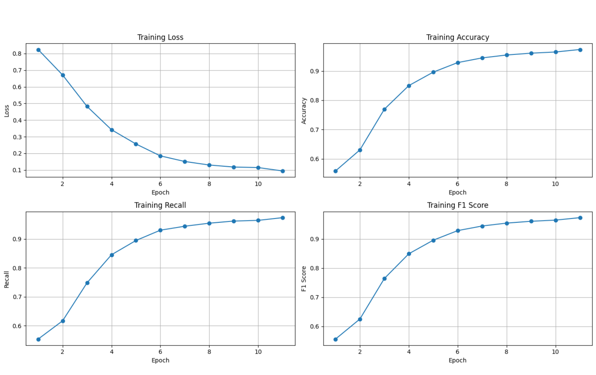
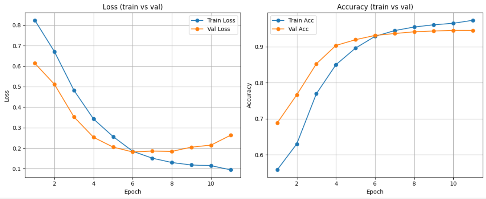

# Pedestrian Intention Estimation — Single-Frame Pipeline on JAAD

End-to-end pipeline to predict pedestrian **crossing vs not crossing** on the **JAAD** dataset.
The solution is intentionally **single-frame based** (no LSTM/temporal context): each frame is processed independently, yet it also uses contextual metadata (pose keypoints, traffic, vehicle, appearance, attributes).

## What this code does
1. **Extracts frames** from `JAAD_clips/*.mp4`, draws pedestrian bbox, and **detects 33 pose keypoints** with MediaPipe
2. **Preprocesses JAAD annotations** (crossing label + traffic/vehicle/appearance/attributes)
3. **Builds Torch datasets**
4. **Trains a classifier**
5. **Evaluates** with a validation/test split; threshold is optionally chosen to maximize accuracy

The training loop uses early stopping, addresses class imbalance with balanced sampling, employs a VGG19-based single-frame architecture (no temporal modeling), and focuses on the pedestrian with the largest bounding box.

GPU is recommended. JAAD dataset and annotations must be downloaded.
## Expected dataset layout (input)
Place your JAAD data like below (names are **case-sensitive**):

```
JAAD_dataset/
├─ annotations/
├─ annotations_appearance/
├─ annotations_attributes/
├─ annotations_traffic/
├─ annotations_vehicle/
└─ JAAD_clips/
   ├─ video_0001.mp4
   ├─ video_0002.mp4
   ├─ video_0003.mp4
   └─ ...
```


## Final Results

| Split      |  Loss  | Accuracy | Recall | F1 Score |
|------------|-------:|---------:|-------:|---------:|
| Train      | 0.1850 | 0.9287   | 0.9300 | 0.9288   |
| Validation | 0.1815 | 0.9313   | 0.9276 | 0.9310   |
| Test       | 0.1818 | 0.9311   | 0.9152 | 0.9300   |


<p align="center">
  <br>
  <em>Training loss, accuracy, recall and F1 score across epochs (6th epoch selected by early stopping)</em>
</p>

<p align="center">
  <br>
  <em>Training and validation loss and accuracy across epochs (6th epoch selected by early stopping)</em>
</p>